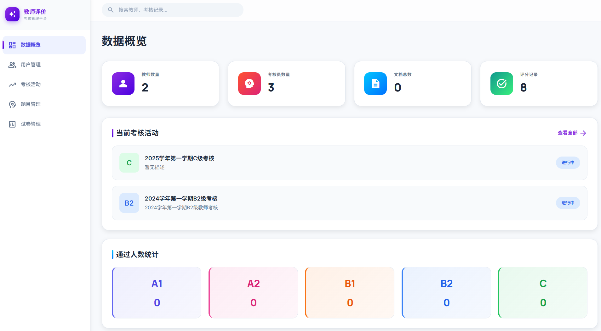
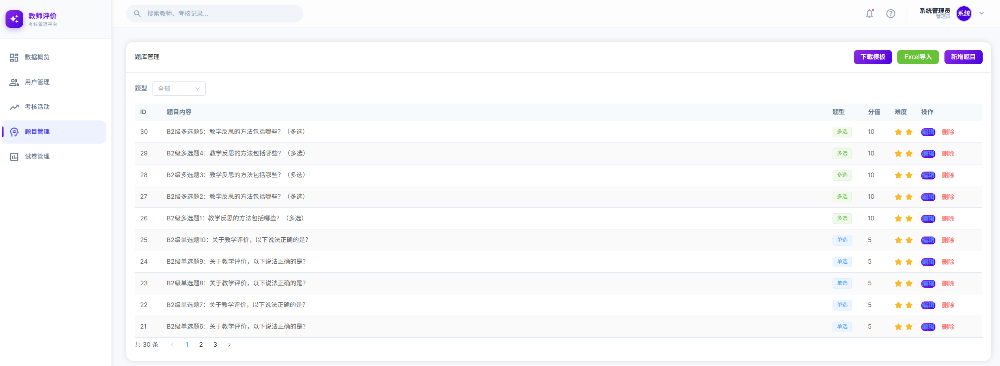
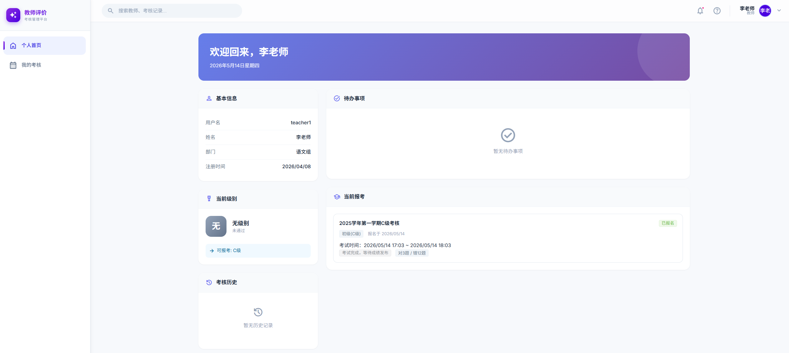
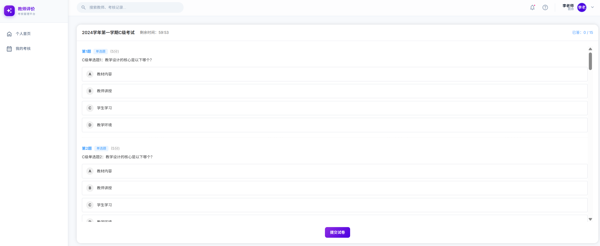
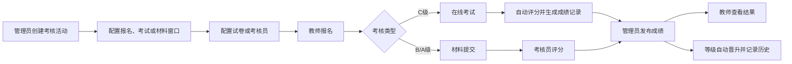

# 教师评价考核平台

[](https://github.com/zouyu8377-coder/teacher-evaluation)
[](LICENSE)

> 面向中小学教师职称/级别晋升的在线考核评价系统，支持在线考试、材料提交、多维度评分、等级自动晋升等功能。

---

## 平台预览

### 管理端工作台
管理员可以在工作台查看活动、报名、评分、教师等级等全局数据，并快速进入活动管理、题库管理、试卷配置和用户管理等核心模块。



### 题库与试卷配置
题库管理支持单选题、多选题维护，配合试卷配置完成 C 级在线考试的数据准备。



### 教师端工作台
教师端聚合当前等级、考核报名、已报名活动、成绩状态和待办事项，方便教师按流程完成报名、材料提交或在线考试。



### 在线考试
C 级考核支持在线答题、考试倒计时、答案保存和提交试卷。成绩发布后，教师可查看考试结果、通过状态和答题明细。



### 核心业务流程



---

## 功能特性

### 教师等级晋升体系
- 五级晋升通道：**无级别 → C级 → B级 → A级**
- 通过考核活动自动晋升等级，历史可追溯
- 管理员可手动调整教师等级并记录变更历史

### 考核活动管理
- 按级别创建考核活动（C / B2 / B1 / A2 / A1）
- 配置报名时间、考试时间、材料提交窗口
- 设置考核员、最大参与人数、考试时长
- 成绩发布控制，发布后才显示答案和通过状态

### 在线考试
- 试卷与题库关联，支持单选/多选题型
- 在线答题、自动计时、交卷即锁
- 防止重复考试，已交卷不可再次进入
- 成绩发布后展示对错统计和答题详情

### 材料提交与审核
- 教师上传考核相关材料（论文、证书等）
- MinIO 对象存储，支持大文件
- 考核员在线查看、审核材料

### 评分评价
- 多维度评分，支持多人评审
- 评分进度实时统计
- 评分完成后自动计算最终成绩

### 统计看板
- 管理员数据看板：活动统计、报名情况、评分进度
- 教师个人面板：当前等级、考核历史、待办事项
- 考核员评审记录和完成情况

---

## 技术栈

### 后端
| 技术 | 版本 |
|------|------|
| Java | 17 |
| Spring Boot | 3.2.0 |
| Spring Data JPA | Hibernate 6.3 |
| Spring Security + JWT | jjwt 0.12.3 |
| MySQL | 8.0 |
| Redis | 7 |
| MinIO | 对象存储 |
| Swagger / OpenAPI | 2.3.0 |
| Maven | 构建工具 |

### 前端
| 技术 | 版本 |
|------|------|
| Vue | 3 |
| Vite | 8 |
| TypeScript | 5.9 |
| Element Plus | 2.13 |
| Tailwind CSS | 3.4 |
| Pinia | 3 |
| Vue Router | 5 |

---

## 快速开始

### 环境要求
- Docker >= 20.10
- Docker Compose >= 2.0
- Java 17 + Maven 3.8（本地后端开发）
- Node.js >= 20（本地前端开发）

### Docker 一键启动

```bash
git clone https://github.com/zouyu8377-coder/teacher-evaluation.git
cd teacher-evaluation
docker-compose up -d
```

访问：
- 前端：`http://localhost`
- 后端 API：`http://localhost:8080`
- Swagger 文档：`http://localhost:8080/swagger-ui.html`

### 本地开发

**后端：**
```bash
cd backend
mvn clean spring-boot:run
```

**前端：**
```bash
cd frontend
npm install
npm run dev
```

---

## 项目结构

```
teacher-evaluation/
├── backend/                  # Spring Boot 后端
│   ├── src/main/java/        # Java 源码
│   ├── src/main/resources/   # 配置文件
│   └── Dockerfile
├── frontend/                 # Vue 3 前端
│   ├── src/views/            # 页面视图
│   ├── src/api/              # API 封装
│   └── Dockerfile
├── deploy/                   # 生产部署配置
│   ├── docker-compose.yml
│   └── .env
├── docs/                     # 项目文档
├── docker-compose.yml        # 本地 Docker Compose
└── README.md
```

---

## 测试账号

| 角色 | 用户名 | 密码 |
|------|--------|------|
| 管理员 | admin | admin123 |
| 考核员 | evaluator1 | eval123 |
| 教师 | teacher1 | teacher123 |
| 教师 | teacher2 | teacher123 |

---

## 部署

生产服务器：`http://124.174.17.44`

镜像仓库：`teacher-eval-cn-beijing.cr.volces.com`

详细部署说明见 [docs/部署配置.md](docs/部署配置.md)。

---

## 版本记录

| 版本 | 日期 | 主要变更 |
|------|------|---------|
| v1.3.0 | 2026-05-06 | 引入教师等级体系：持久化等级、自动晋升、历史记录、管理端等级修改 |
| v1.2.x | 2026-05 | 考核功能完善、成绩发布优化、C级考试修复 |
| v1.1.7 | 2026-04 | 前后端类型安全重构 |
| v1.0.0 | 2026-04 | 初始版本，完整考核功能上线 |

---

## License

[MIT](LICENSE)
